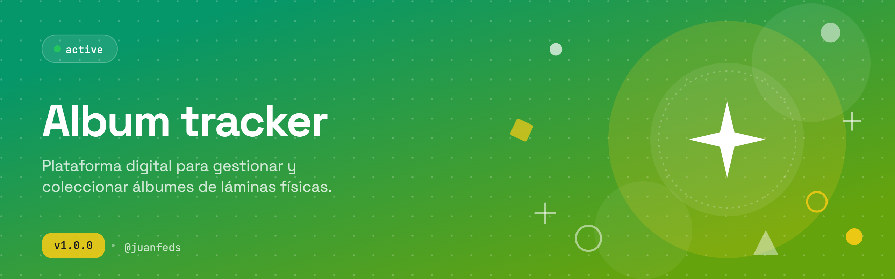

# Album Tracker

<p align="center">
  
</p>

<p align="center">
  
  
  
  
  
  
</p>

Plataforma digital para gestionar y coleccionar álbumes de láminas físicas de cualquier tipo. AlbumIQ transforma la experiencia tradicional del coleccionista: seguimiento de progreso, gestión de repetidas, intercambios inteligentes y estadísticas avanzadas — todo en un solo lugar.

---

## Tabla de contenido

1. [Contexto y motivación](#1-contexto-y-motivación)
2. [Funcionalidades](#2-funcionalidades)
3. [Roadmap](#3-roadmap)
4. [Arquitectura](#4-arquitectura)
5. [Modelo de datos](#5-modelo-de-datos)
6. [Guía de uso](#6-guía-de-uso)
7. [Contacto](#7-contacto)

---

## 1. Contexto y motivación

Coleccionar álbumes de láminas es una actividad masiva, pero el seguimiento es manual y propenso a errores: repetidas acumuladas, intercambios desorganizados y cero métricas.

AlbumIQ busca ser el **centro de control del coleccionista** — comenzando con un tracker funcional y evolucionando hacia una plataforma social con IA.

---

## 2. Funcionalidades

### MVP (Fase 1)

| Área | Funcionalidad |
|---|---|
| Autenticación | Registro, login y OAuth |
| Colección | Marcar láminas como tenidas, repetidas o faltantes |
| Dashboard | Progreso total, por equipo/sección y cantidad de repetidas |
| Perfil público | URL compartible con lista de faltantes |

### Excluido del MVP

- Scanner IA por cámara
- Marketplace y chat
- Matching automático de intercambios
- Sistema social avanzado

---

## 3. Roadmap

```
Fase 1 — MVP            → Tracker manual, dashboard, compartir progreso
Fase 2 — Social         → Amigos, matching de intercambios, rankings
Fase 3 — IA             → Scanner OCR/visión, sugerencias automáticas
Fase 4 — Multi-álbum    → Soporte para cualquier álbum o colección física
```

---

## 4. Arquitectura

AlbumIQ sigue **Clean Architecture** (Robert C. Martin): las dependencias apuntan siempre hacia adentro.

```
┌──────────────────────────────────────────────────────┐
│                   Presentation                        │
│         (React · Pages · Components · Hooks)          │
│  ┌────────────────────────────────────────────────┐   │
│  │                Application                     │   │
│  │         (Use Cases · DTOs · Ports)             │   │
│  │  ┌──────────────────────────────────────────┐  │   │
│  │  │               Domain                     │  │   │
│  │  │  (Entities · Value Objects · Interfaces) │  │   │
│  │  └──────────────────────────────────────────┘  │   │
│  └────────────────────────────────────────────────┘   │
│  ┌────────────────────────────────────────────────┐   │
│  │             Infrastructure                     │   │
│  │      (Supabase · Storage · Auth · APIs)        │   │
│  └────────────────────────────────────────────────┘   │
└──────────────────────────────────────────────────────┘
```

> El `domain` no importa nada externo. Los hooks nunca hablan directamente a Supabase.

### Flujo de datos

```
Usuario → Hook → Use Case → Repository Interface → Supabase → DB
```

### Estructura del proyecto

```
src/
├── domain/          # Entidades, Value Objects, interfaces (puertos)
├── application/     # Use cases, DTOs
├── infrastructure/  # Supabase repos, auth, storage
└── presentation/    # Componentes, páginas, hooks, stores (Zustand)
```

---

## 5. Modelo de datos

Tres tablas principales en Supabase con RLS habilitado:

| Tabla | Descripción |
|---|---|
| `stickers` | Catálogo de láminas (código, equipo, rareza, sección) |
| `profiles` | Usuarios extendidos desde `auth.users` |
| `user_stickers` | Relación usuario ↔ lámina con cantidad |

RLS garantiza que cada usuario solo acceda a su propia colección.

---

## 6. Guía de uso

### Requisitos

- Node.js 20+
- Cuenta en [Supabase](https://supabase.com)

### Instalación

```bash
git clone https://github.com/JuanFeDS/albumiq.git
cd albumiq
npm install
```

### Variables de entorno

Crea un archivo `.env.local` en la raíz:

```env
VITE_SUPABASE_URL=https://<tu-proyecto>.supabase.co
VITE_SUPABASE_ANON_KEY=<tu-anon-key>
```

### Base de datos

```bash
# Aplica las migraciones en tu proyecto Supabase
# desde el panel SQL Editor o con Supabase CLI:
supabase db push
```

### Desarrollo local

```bash
npm run dev
```

### Otros comandos

```bash
npm run build       # Build de producción
npm run typecheck   # Verificación de tipos
npm run lint        # Linting
npm run format      # Formateo con Prettier
```

---

## 7. Contacto

**JuanFe** — [jmartinezbernal02@gmail.com](mailto:jmartinezbernal02@gmail.com)

Proyecto en desarrollo activo. Issues y PRs son bienvenidos.
